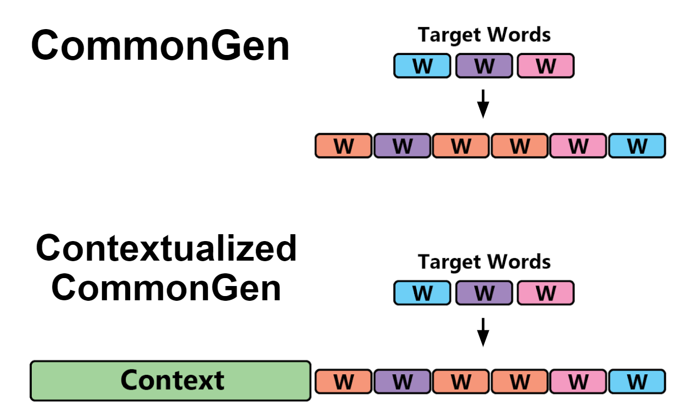

<!--
*** Thanks for checking out the Best-README-Template. If you have a suggestion
*** that would make this better, please fork the repo and create a pull request
*** or simply open an issue with the tag "enhancement".
*** Thanks again! Now go create something AMAZING! :D
-->


<!-- PROJECT SHIELDS -->
<!--
*** I'm using markdown "reference style" links for readability.
*** Reference links are enclosed in brackets [ ] instead of parentheses ( ).
*** See the bottom of this document for the declaration of the reference variables
*** for contributors-url, forks-url, etc. This is an optional, concise syntax you may use.
*** https://www.markdownguide.org/basic-syntax/#reference-style-links
-->


<!-- PROJECT LOGO -->
<br />
<p align="center">
  <h1 align="center">Fine-grained controllable text generation via Non-Residual Prompting</h1>
<p align="center">
    <a href="https://aclanthology.org/2022.acl-long.471/">ACL paper</a>
    ·
    <a href="https://huggingface.co/Non-Residual-Prompting">Pre-trained Models </a>
    ·
    <a href="https://huggingface.co/datasets/Non-Residual-Prompting/C2Gen">Dataset</a>
  </p>
</p>

<!-- TABLE OF CONTENTS -->
<details>
  <summary>Table of Contents</summary>
  <ol>
    <li>
      <a href="#overview">Overview</a>
    </li>
    <li>
      <a href="#getting-started">Getting Started</a>
    </li>
    <li><a href="#usage">Usage</a></li>
        <ul>
        <li><a href="#inference">Inference</a></li>
        <li><a href="#evaluation">Evaluation</a></li>
      </ul>
    <li><a href="#contributing">Contributing</a></li>
    <li><a href="#license">License</a></li>
    <li><a href="#contact">Contact</a></li>
    <li><a href="#acknowledgments">Acknowledgments</a></li>
  </ol>
</details>

<!-- ABOUT THE PROJECT -->
## Overview


This is the official code for the paper [Fine-Grained Controllable Text Generation Using Non-Residual Prompting](https://aclanthology.org/2022.acl-long.471/). \
The paper was accepted at ACL-2022, and official reviews and responses can be found at [ACL Reviews.pdf](https://github.com/FreddeFrallan/Non-Residual-Prompting/blob/master/ACL%20Reviews.pdf) \
A short video summary of the work can be found on [Youtube](https://youtu.be/s_rGz3P34KY).


Controlling the generative process for large causal language models is at large an unsolved problem. In our approach, we try to move towards a more steerable generation process by enabling high-level prompt instructions at arbitrary time steps.

We introduce a separate language model for the prompt instructions, that generate positionally invariant hidden states. This prompt model is then used to steer the generative model.
Using non-redisual attention, we keep track of two streams of information in the original generative model. This allows us to steer the text generation without leaving any disruptive footprints in the hidden states.

<!-- GETTING STARTED -->
## Getting Started


### Requirements 
The packages can be found in the requirements file. The only strong requirement is to use the version  **transformers==4.8.1**.

`pip install -r requirements.txt`
## Usage

### Inference 
After installing the required packages, generating text is easily done by 
using `./inference.sh`. It contains some arguments:
- **TARGET_WORDS**: The space-separated words to be included in the generated text.
- **CONTEXT**: The context that the model continues to generate from.
- **SENTENCE_LENGTH**: The target sentence length to instruct the model with
- **GENERATE_LENGTH**: The number of tokens in the resulting text
- **NUM_BEAMS**: The number of beams used within beam search

*The trained model used in the paper will be downloaded automatically from [HuggingFace](https://huggingface.co/Non-Residual-Prompting).*

### Evaluation 
To evaluate texts, use `./evaluate.sh` that takes an input file with a json list of texts as a positional argument.

*Note that the order of the texts within this list must correspond to the order of samples in the evaluation dataset.*

This file got some settings that can be configured:
- **DATASET**: `common_gen` or `c2gen` *Datasets are automatically loaded from HuggingFace*
- **PPL_MODEL_NAME**: The name of the model to use, the paper uses `gpt2-xl`
- **PPL_BATCH_SIZE**: With many texts and access to a large GPU, this can be increased for faster evaluation.
- **CONTEXT**: The custom context that was used when generating the texts. For example, when generating with no context (common_gen) the model may need an initial string to condition the generation on, like 'The'.
- **SENTENCE_LEVEL**: Leave as `--sentence_level` for sentence-level evaluation, or empty string for Free Text evaluation.

## Dataset


### Contextualized CommonGen Dataset (C<sup>2</sup>Gen)
In this paper we also introduce a new dataset that is based on the CommonGen dataset. In the CommonGen dataset
the objective of the task is to generate text that includes a given set of target words and that adheres
to common sense. These examples are however all formulated without any context, where we believe that many application 
areas need to take context into account. 

Therefore, to complement CommonGen, we provide an extended test set of CommonGen, called Contextualized CommonGen Dataset (C<sup>2</sup>Gen)
where a context is provided for each set of target words. The task is therefore reformulated to both
generate commonsensical text which includes the given words, and also have the generated text adhere
to the given context as shown on the Figure below.




The dataset is uploaded on HuggingFace, so you can directly inspect the dataset here and incorporate it into your framework: [Non-Residual-Prompting/C2Gen](https://huggingface.co/datasets/Non-Residual-Prompting/C2Gen).

<!-- CONTRIBUTING -->
## Contributing


Contributions are what make the open source community such an amazing place to learn, inspire, and create. Any contributions you make are **greatly appreciated**.

If you have a suggestion that would make this better, please fork the repo and create a pull request. You can also simply open an issue with the tag "enhancement".
Don't forget to give the project a star! Thanks again!


<!-- CONTACT -->
## Contact

If you have questions regarding the code or otherwise related to this Github page, please open an [issue](https://github.com/FreddeFrallan/Contrastive-Tension/issues).

For other purposes, feel free to contact me directly at: Fredrk.Carlsson@ri.se

<!-- ACKNOWLEDGEMENTS -->
## Acknowledgements

* [CommonGen](https://github.com/INK-USC/CommonGen)
* [Huggingface](https://huggingface.co/)
* [Best Readme Template](https://github.com/othneildrew/Best-README-Template)

<!-- LICENSE -->
## License

Distributed under the MIT License. See `LICENSE` for more information.
<!-- CITING -->
## Citing & Authors

If you find this repository helpful, feel free to cite our publication [Fine-grained controllable text generation via Non-Residual Prompting](https://aclanthology.org/2022.acl-long.471/):

```bibtex 
@inproceedings{carlsson-etal-2022-fine,
    title = "Fine-Grained Controllable Text Generation Using Non-Residual Prompting",
    author = {Carlsson, Fredrik and Öhman, Joey and Liu, Fangyu and 
    Verlinden, Severine and Nivre,Joakim and Sahlgren, Magnus},
    booktitle = "Proceedings of the 60th Annual Meeting of the Association for Computational Linguistics (Volume 1: Long Papers)",
    month = may,
    year = "2022",
    address = "Dublin, Ireland",
    publisher = "Association for Computational Linguistics",
    url = "https://aclanthology.org/2022.acl-long.471",
    pages = "6837--6857",
 }

```

<!-- MARKDOWN LINKS & IMAGES -->
<!-- https://www.markdownguide.org/basic-syntax/#reference-style-links -->
[contributors-shield]: https://img.shields.io/github/contributors/othneildrew/Best-README-Template.svg?style=for-the-badge
[contributors-url]: https://github.com/othneildrew/Best-README-Template/graphs/contributors
[forks-shield]: https://img.shields.io/github/forks/othneildrew/Best-README-Template.svg?style=for-the-badge
[forks-url]: https://github.com/othneildrew/Best-README-Template/network/members
[stars-shield]: https://img.shields.io/github/stars/othneildrew/Best-README-Template.svg?style=for-the-badge
[stars-url]: https://github.com/othneildrew/Best-README-Template/stargazers
[issues-shield]: https://img.shields.io/github/issues/othneildrew/Best-README-Template.svg?style=for-the-badge
[issues-url]: https://github.com/othneildrew/Best-README-Template/issues
[license-shield]: https://img.shields.io/github/license/othneildrew/Best-README-Template.svg?style=for-the-badge
[license-url]: https://github.com/othneildrew/Best-README-Template/blob/master/LICENSE.txt
[linkedin-shield]: https://img.shields.io/badge/-LinkedIn-black.svg?style=for-the-badge&logo=linkedin&colorB=555
[linkedin-url]: https://linkedin.com/in/othneildrew
[product-screenshot]: images/screenshot.png
